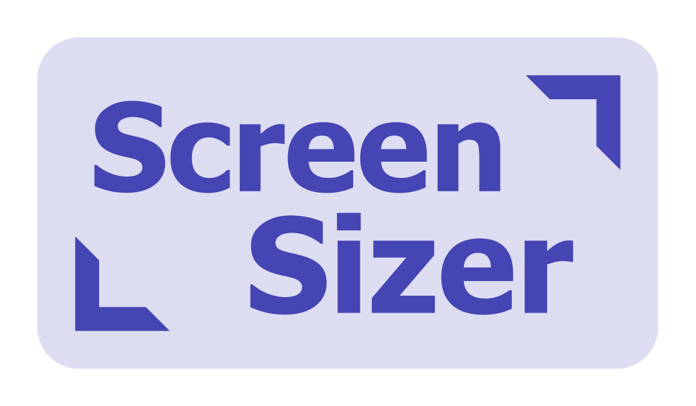

# ReactNative Screen Sizer

<p align="center">

</p>

Quickly check how your app looks on different screen sizes.

**TODO: GIF/VIDEO**

## Installation

Currently, screen-sizer will only work with expo projects.

```sh
yarn add react-native-screen-sizer
```

You'll need to have these dependencies installed:

```
npx expo install expo-dev-client
npx expo install react-native-safe-area-context
```

Then, add it to `App.tsx`:

```tsx
import { SafeAreaProvider } from 'react-native-safe-area-context';

// 👋 Add the import
import * as ScreenSizer from 'react-native-screen-sizer';

// 👋 Call this at the top-level of App.tsx. It will handle some things like patching keyboard events.
ScreenSizer.setup();

export const App = () => {
  // ...

  return (
    <SafeAreaProvider>
      <ScreenSizer.Wrapper>
        {/* 👋 `ScreenSizer.Wrapper` must be inserted inside `SafeAreaProvider` but **around** any provider or component that uses safe area dimensions */}
        {/* The rest of your providers and your app */}
      </ScreenSizer.Wrapper>
    </SafeAreaProvider>
  );
};
```

**NOTE**: The `Wrapper` and the setup function are no-ops in release builds, so you can safely add them without adding `__DEV__` conditions yourself.

## Usage

- We recommend using a big screen (eg `iPhone 14 Pro Max`) as the "base device" to develop on.
- Open the expo dev menu (cmd+d) and tap "Toggle Screen Sizer"
- You're in screen sizer mode!

## Making it work well

Things should be mostly ok without changing anything in your app code, but you can get better fidelity (and by the way handle screen resizing on device like iPad better) by following these guidelines:

### Read screen / window / safe area dimensions through `react-native-safe-area-context`

- ❌ `import { SafeAreaView, useWindowDimensions } from "react-native"`
- ✅ `import { SafeAreaView, useSafeAreaInsets, useSafeAreaFrame } from "react-native-safe-area-context"`

react-native-screen-sizer adds a custom react-native-safe-area-context provider to emulate the safe area insets and frame of the "sized device".
Currently, other ways to read these dimensions (like the ones in the base `react-native` package) are not supported.

### Always read screen / window / safe area dimensions in a reactive manner

- ❌ `import { Dimensions } from "react-native`
- ❌ `import { initialMetrics } from "react-native-safe-area-context"`
- ✅ `import { SafeAreaView, useSafeAreaInsets, useSafeAreaFrame } from "react-native-safe-area-context"`

If you use "static" dimensions, you app won't re-render properly when the device size changes. This applies to the "emulated size" from this package, but also to the real size (eg window resizing on iPad or M1 macs, or switching to landscape mode), so it's a good thing to do anyway!

### Eslint config

You can setup these eslint rules to enforce some of the guidelines above:

```json
{
  "no-restricted-imports": [
    "error",
    {
      "paths": [
        {
          "name": "react-native",
          "importNames": ["Dimensions", "useWindowDimensions"],
          "message": "Read dimensions with `useSafeAreaFrame` from `react-native-safe-area-context` instead (to support screen-sizer)"
        }
      ]
    }
  ]
}
```

### Current limitations

- Only apps with the **expo dev menu** have access to the button to enable screen sizer mode for now
- **Landscape mode** is not supported
- On android, the **status bar** inset is (probably 🤔) applied as if the status bar is visible and translucent
- **Keyboard insets** emulation is very experimental, don't trust it too much
- If the "base device" is smaller than the "sized screen", behaviour is undefined

## Contributing

See the [contributing guide](CONTRIBUTING.md) to learn how to contribute to the repository and the development workflow.

## License

MIT

---

Made with [create-react-native-library](https://github.com/callstack/react-native-builder-bob)
