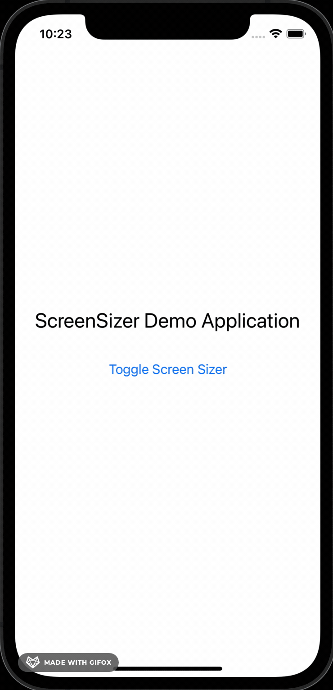

<p align="center">

</p>

# ReactNative Screen Sizer

Quickly check how your app looks on different screen sizes.



## Setup

```sh
yarn add @bam.tech/react-native-screen-sizer
```

You'll also need to have these dependencies installed:

- if you use `expo go`:
  ```bash
  npx expo install react-native-safe-area-context
  ```
- if you use `expo` with a custom build:
  ```bash
  npx expo install react-native-safe-area-context expo-dev-client
  ```
- if you use a bare React Native project:
  ```bash
  yarn add react-native-safe-area-context
  npx pod-install
  ```

Then, add it to `App.tsx`:

```tsx
import { SafeAreaProvider } from 'react-native-safe-area-context';

/* 👋 Add the import */
import * as ScreenSizer from '@bam.tech/react-native-screen-sizer';

/* 👋 Call this at the top-level of App.tsx. It will handle some things like 
register shortcuts in the dev menu. */
ScreenSizer.setup();

export const App = () => {
  // ...

  return (
    <SafeAreaProvider>
      <ScreenSizer.Wrapper
        /* 👋 The list of devices that will be emulated. You can use some of our
        default devices, custom ones, or the keyword 'hostDevice' to reference
        your current host device. */
        devices={[...ScreenSizer.defaultDevices.all, 'hostDevice']}
      >
        {/* 👋 `ScreenSizer.Wrapper` must be inserted inside `SafeAreaProvider`
        but around any provider or component that uses safe area dimensions */}
        {/* The rest of your providers and your app */}
      </ScreenSizer.Wrapper>
    </SafeAreaProvider>
  );
};
```

> **NOTE**: The `Wrapper` and the setup function are no-ops in release builds,
> so you can safely add them without adding `__DEV__` conditions yourself.

## Usage

By default, the screen sizer is disabled when you run your app. You can enable it by different ways:

- Open the dev menu (<kbd>⌘ cmd</kbd> + <kbd>D</kbd> on iOS or
  <kbd>⌘ cmd</kbd> + <kbd>M</kbd> on Android)
  and tap `"📐 Toggle Screen Sizer"`
- or import the function `ScreenSizer.toggleScreenSizer()` in your code
  and link it to a button to activate the screen sizer

Compatibility of each method by project type:

|                        | React Native Dev Menu | Expo Dev Menu | `toggle` function |
| ---------------------- | :-------------------: | :-----------: | :---------------: |
| Bare React Native      |          ✅           |      ❌       |        ✅         |
| Expo Go                |          ❌           |      ❌       |        ✅         |
| Expo Custom Dev Client |          ✅           |      ✅       |        ✅         |

## Making it work well

Things should be mostly ok without changing anything in your app code, but you can get better fidelity (and by the way handle screen resizing on device like iPad better) by following these guidelines:

### Use a big screen as the "base device"

We recommend using a big screen (eg `iPhone 14 Pro Max`) as the "base device" to develop on.

If your base device is too small for one of the screens you want to emulate, the behavior for this screen is undefined and you'll get a warning in the console.

### Read screen/window/safe-area dimensions through `react-native-safe-area-context`

- ❌ `import { SafeAreaView, useWindowDimensions } from "react-native"`
- ✅ `import { SafeAreaView, useSafeAreaInsets, useSafeAreaFrame } from "react-native-safe-area-context"`

`react-native-screen-sizer` adds a custom `react-native-safe-area-context` provider to emulate the safe area insets and frame of the "sized device".
Currently, other ways to read these dimensions (like the ones in the base `react-native` package) are not supported.

### Always read screen/window/safe-area dimensions in a reactive manner

- ❌ `import { Dimensions } from "react-native`
- ❌ `import { initialMetrics } from "react-native-safe-area-context"`
- ✅ `import { SafeAreaView, useSafeAreaInsets, useSafeAreaFrame } from "react-native-safe-area-context"`

If you use "static" dimensions, you app won't re-render properly when the device size changes. This applies to the "emulated size" from this package, but also to the real size (eg window resizing on iPad or M1 macs, or switching to landscape mode), so it's a good thing to do anyway!

### Eslint config

You can setup these eslint rules to enforce some of the guidelines above:

```json
{
  "no-restricted-imports": [
    "error",
    {
      "paths": [
        {
          "name": "react-native",
          "importNames": ["Dimensions", "useWindowDimensions"],
          "message": "Read dimensions with `useSafeAreaFrame` from `react-native-safe-area-context` instead (to support screen-sizer)"
        }
      ]
    }
  ]
}
```

## API

### `ScreenSizer.setup`

A function that should be called on initialization.

### `ScreenSizer.Wrapper`

A wrapper component to simulate the different screens.

| Props              | Type                                      | Description                                                                                                                                                          |
| ------------------ | ----------------------------------------- | -------------------------------------------------------------------------------------------------------------------------------------------------------------------- |
| devices            | `Array<Device \| 'hostDevice'>`, optional | A list of device specifications. If a device is bigger than the host device, a warning will be prompted in the console. Default to `ScreenSizer.defaultDevices.all`. |
| activatedByDefault | boolean, optional                         | Specify if the ScreenSizer should be activated by default when the app starts. Default to false.                                                                     |

> **NOTE**: `Device` has the following type:
>
> ```typescript
> export type Device = {
>   name: string;
>   width: number;
>   height: number;
>   insets?: Partial<Insets>;
>   landscapeInsets?: Partial<Insets>;
> };
>
> type Insets = {
>   top: number;
>   bottom: number;
>   left: number;
>   right: number;
> };
> ```

### `ScreenSizer.defaultDevices`

An object containing different default device specifications, meant to be used for the `devices` props of the wrapper.

| Properties   | Type            | Description: width x height (topInset - bottomInset) |
| ------------ | --------------- | ---------------------------------------------------- |
| iPhoneSE2016 | `Device`        | 320 x 568 (20 - 0)                                   |
| iPhoneSE2022 | `Device`        | 375 x 667 (20 - 0)                                   |
| iPhone12Mini | `Device`        | 375 x 812 (44 - 34)                                  |
| iPhone12Pro  | `Device`        | 390 x 844 (47 - 34)                                  |
| galaxyS8     | `Device`        | 360 x 740 (24 - 0)                                   |
| all          | `Array<Device>` | List of all previous devices.                        |

### `ScreenSizer.toggleScreenSizer`

A function to activate or deactivate the screen-sizer mode. No parameters.

## Current limitations

- On android, the **status bar** inset is applied as if the status bar is visible and translucent

## 👉 About Bam

We are a 100 people company developing and designing multi-platform applications with [React Native](https://www.bam.tech/expertise/react-native) using the Lean & Agile methodology. To get more information on the solutions that would suit your needs, feel free to get in touch by [email](mailto:contact@bam.tech) or through our [contact form](https://www.bam.tech/en/contact)!

We will always answer you with pleasure 😁
